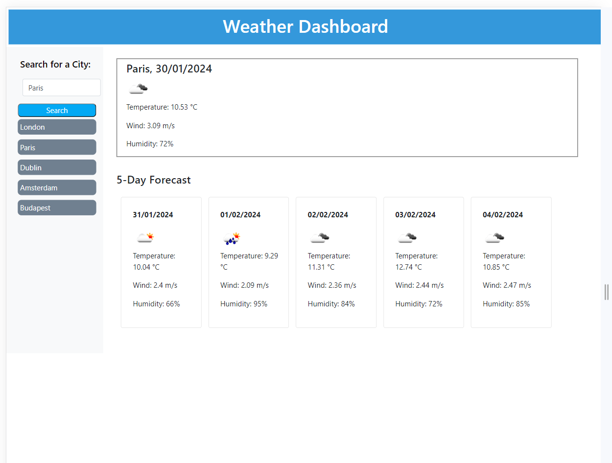

# Weather-Dashboard
Application providing a weather outlook for multiple cities

## User Story

AS A traveler
I WANT to see the weather outlook for multiple cities
SO THAT I can plan a trip accordingly

## Acceptance Criteria

I will have met the brief when the following acceptance criteria are met:

The app should consist of the following:

* Create a weather dashboard with form inputs.
  * When a user searches for a city they are presented with current and future conditions for that city and that city is added to the search history
  * When a user views the current weather conditions for that city they are presented with:
    * The city name
    * The date
    * An icon representation of weather conditions
    * The temperature
    * The humidity
    * The wind speed
  * When a user view future weather conditions for that city they are presented with a 5-day forecast that displays:
    * The date
    * An icon representation of weather conditions
    * The temperature
    * The humidity
  * When a user click on a city in the search history they are again presented with current and future conditions for that city

## Installation

No particular installation requirements. Web page can be viewed using Chrome, Firefox, Safari or most other standard browser, using "Inspect" Console to see the output 
The "Application" tab in Inspect can be used to see the scores which have been saved to LocalStorage. "Network" can display the API calls

## Usage 

This site can be accessed on GitPages [HERE](https://mandyjmiller.github.io/Weather-Dashboard/)

Screenshot of the site can be seen here:

## Credits

Shout out to the teaching team at EdX and fellow students for help and collaboration.

This week's challenge was difficult, so there was a lot of Googling going on.

Particular credit to the following sites for help and guidance :

https://dev.to/iamcymentho/building-a-complete-weather-app-from-scratch-with-html-css-and-javascript-a-step-by-step-guide-30h4

https://www.youtube.com/watch?v=SeXg3AX82ig

API documentation from: https://openweathermap.org/

Some troubleshooting thanks to https://chat.openai.com/

Other Tutorials and base materials from  [Module 8 Challenge](https://bootcampspot.instructure.com/courses/5651/assignments/67074)

## License

MIT License

Copyright (c) 2023 Mandy Miller

Permission is hereby granted, free of charge, to any person obtaining a copy
of this software and associated documentation files (the "Software"), to deal
in the Software without restriction, including without limitation the rights
to use, copy, modify, merge, publish, distribute, sublicense, and/or sell
copies of the Software, and to permit persons to whom the Software is
furnished to do so, subject to the following conditions:

The above copyright notice and this permission notice shall be included in all
copies or substantial portions of the Software.

THE SOFTWARE IS PROVIDED "AS IS", WITHOUT WARRANTY OF ANY KIND, EXPRESS OR
IMPLIED, INCLUDING BUT NOT LIMITED TO THE WARRANTIES OF MERCHANTABILITY,
FITNESS FOR A PARTICULAR PURPOSE AND NONINFRINGEMENT. IN NO EVENT SHALL THE
AUTHORS OR COPYRIGHT HOLDERS BE LIABLE FOR ANY CLAIM, DAMAGES OR OTHER
LIABILITY, WHETHER IN AN ACTION OF CONTRACT, TORT OR OTHERWISE, ARISING FROM,
OUT OF OR IN CONNECTION WITH THE SOFTWARE OR THE USE OR OTHER DEALINGS IN THE
SOFTWARE.

---

© 2023 edX Boot Camps LLC. Confidential and Proprietary. All Rights Reserved.